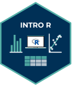

  

# Intro to R (2026)

This course provides an introduction to the statistical programming language R. The course material centers on the core tasks necessary to perform statistical analyses underlying quantitative research in the social sciences. No previous knowledge of R is necessary to follow this course, we will begin from zero by explaining the logic behind coding in general, then move to getting more familiar with R. The goal of this course is to get the students comfortable with using R and provide them with an introduction to key functions, packages, applied to prominent datasets in Political Science.

Upon successful completion of the course, students are capable of performing the complete workflow of a quantitative research project in R before conducting an analysis. This includes basic R programming, data import, data cleaning and wrangling, exploratory data analysis and visualization. Additionally, students will perform coding exercises on their own.

## Instructors

[Johann-Friedrich Salzmann](https://www.sowi.uni-mannheim.de/gschwend/team/postdocs-and-doctoral-students/joff-salzmann/) and [Joshua Elias Schmidt Rodrigues](https://www.sowi.uni-mannheim.de/gschwend/team/postdocs-and-doctoral-students/joshua-schmidt-rodrigues/)

## Helpful Links

- [Syllabus](resouces/Syllabus%20Intro%20to%20R%202026.pdf)
- [Project template](resouces/R%20project%20template.zip) — unzip and open before Day 1. Includes an RStudio/Positron project (`.Rproj` / `.code-workspace`) with the working directory already set via relative paths, plus a `setup.R` that installs every package the course uses.

## Course Material

Day-by-day materials are added here as the course progresses.

- [`d01/`](d01) — Day 1: The Logic of Programming and the R Environment
- [`d02/`](d02) — Day 2: Data Visualization

## Content

### 1. The Logic of Programming and the R Environment

- Setup: Positron vs. RStudio & Github 101
- Package management
- Basic Functionality (Calculations, Vectors, Matrices, Lists)
- Variable types
- Accessing, subsetting, assigning, naming objects; indexing
- Piping

### 2. Data Visualization

- Base R plots vs. ggplot2
- The grammar of plots
- Scatter plots, Line plots, Bar plots, Pie plots
- Boxplots, Histogram, Density plots
- Color scales, Groups, Faceting
- Quarto Reports, Shiny Apps, Plot.ly

### 3. Data Manipulation

- The tidyverse – dplyr
- Loading and storing data (csv, dta, sav, xlsx)
- Ordering your data
- Transforming variables
- Missing values
- Merging data (join, bind_rows), restructuring data (pivot)
- Aggregation (summarise, mutate, sums & means of booleans)

### 4. R Programming

- Functions (normal vs. anonymous) & Operators
- For-Loops & Apply functions
- Purrr & rowwise, expand_grid
- If/Else & Vectorised operations
